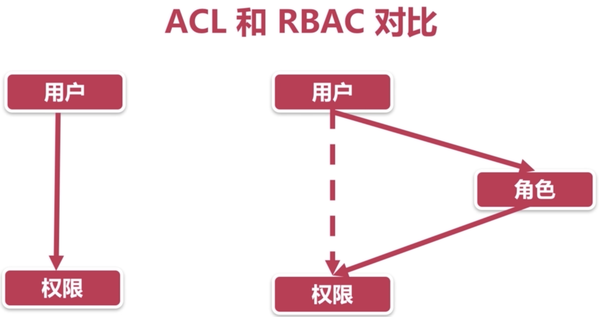
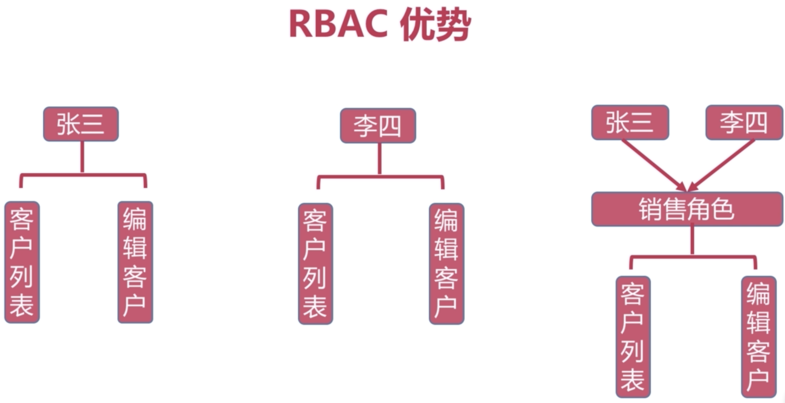
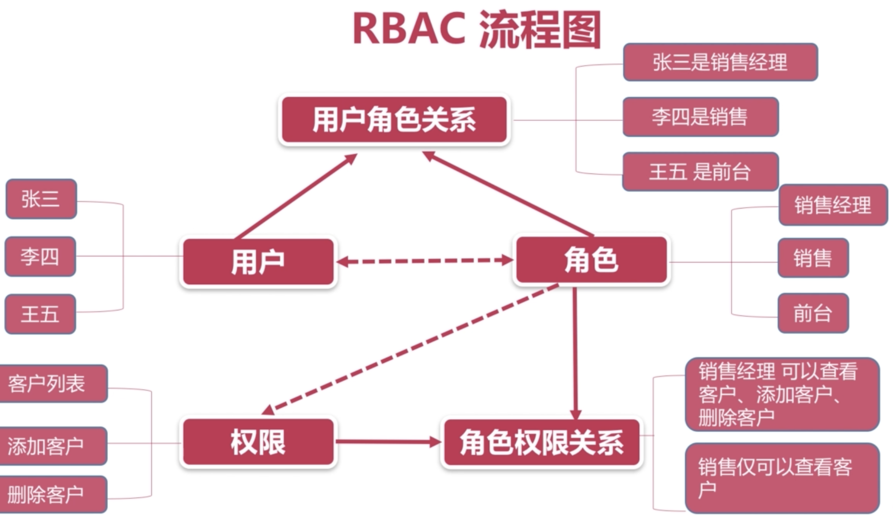
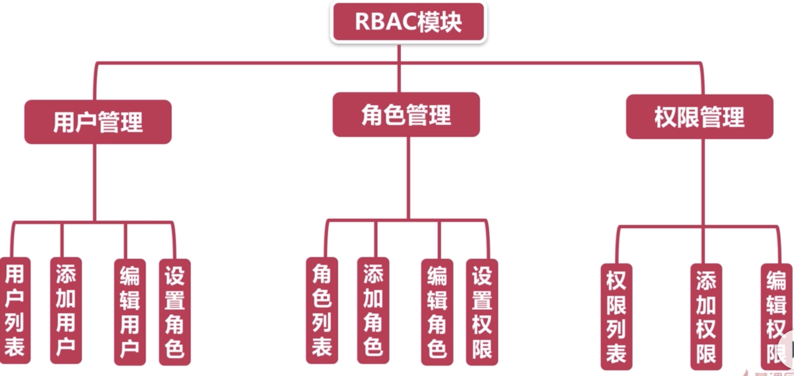

### 1. 权限模型
1. ACL(访问控制列表)
2. RBAC(基于角色的权限控制)(Role-Based Access Control)
3. ABAC(基于属性的权限控制)
4. PBAC(基于策略的权限控制)

#### 1.1 ACL和RBAC对比
ACL实现了用户和角色的直接关联，RBAC实现了用户和角色的间接关联。RBAC比ACL多了角色这一属性。

#### 1.2 RBAC的优势
1. 简化了用户和权限的关系
2. 易扩展、易于维护

RBAC实现了权限与角色关联，用户与角色关联，这样就间接实现了用户与权限的关联。

对于ACL模型，给张三和李四增加权限需要操作两次，而对于RBAC模型，只需要给张三和李四对应的角色添加权限即可，只需要操作一次。
#### 1.3 RBAC的流程图

#### 1.4 RBAC的模块功能

### 参考文档
1. 