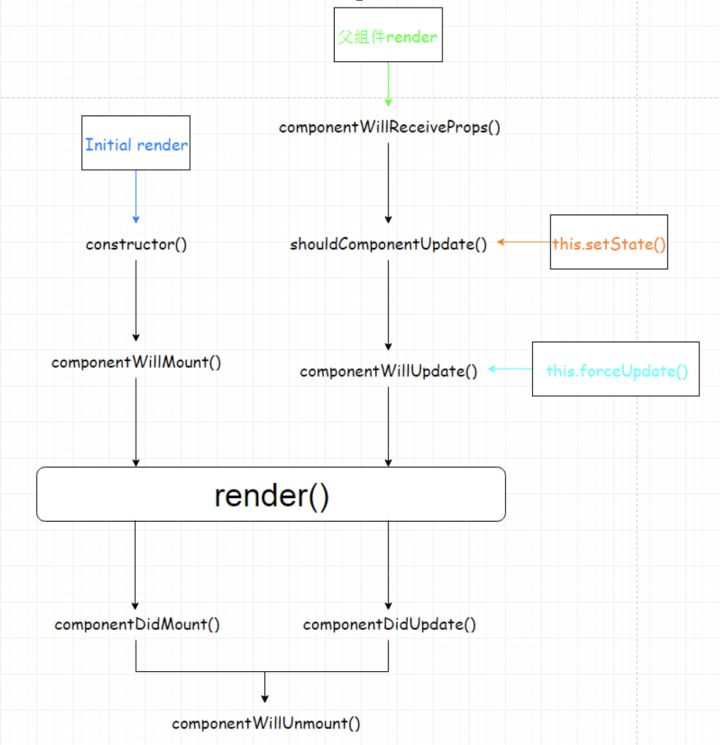

React严格定义了组件的生命周期会经历如下三个过程：

* **装载过程(Mount):** 组件第一次在DOM树中渲染的过程
* **更新过程(Update):** 组件被重新渲染的过程
* **卸载过程(Unmount):** 组件从DOM树中删除的过程

执行这3个过程的调用函数就是声明周期函数。
### 1.生命周期相关函数

* **constructor(props)**

构造函数，在创建组件的时候调用一次。

* **组件加载：componentWillMount()**

`componentWillMount`会在组件`render`之前执行，并且永远都**`只执行一次`**。由于`componentWillMount`始终只执行一次，所以如果在这里定义了setState方法之后，页面永远都只会在加载前更新一次，本次的render函数可以看到更新后的state，并且只渲染一次。

* **组件加载：componentDidMount()**

`componentDidMount()`方法会在组件加载完毕之后(即**在render方法之后**)立即执行。在这个时候组件已经生成了相应的DOM结构，可以通过`this.getDOMNode()`来进行访问。

如果你想和其他JavaScript框架一起使用，可以在这个方法中执行`setTimeout, setInterval`或者发送`AJAX`请求等操作(防止异步操作阻塞UI)。

在组件挂载之后调用一次。这个时候，子组件也都挂载好了，可以在这里使用refs。

**异步请求数据一般都在该函数内进行。**

* **组件更新：componentWillReceiveProps(nextProps)**

当父组件的render函数被调用时，在render里渲染的子组件就会经历更新过程，不管父组件传递给子组件的props有没有改变，都会触发`componentWillReceiveProps`。

在这个函数内调用this.setState()方法不会增加一次新的render。

```
componentWillReceiveProps: function(nextProps) {
  this.setState({
    likesIncreasing: nextProps.likeCount > this.props.likeCount
  });
}
```
props是父组件传递给子组件的。父组件发生render的时候子组件就会调用componentWillReceiveProps（不管props有没有更新，也不管父子组件之间有没有数据交换）。

* **组件更新：shouldComponentUpdate(nextProps, nextState)**

`render和shouldComponentUpdate`是React中需要有返回值的两个函数，`shouldComponentUpdate`返回一个布尔值，决定了组件是否需要更新，返回true则更新，返回false则停止更新，不会触发之后的重新渲染。

在组件接收到新的props或者state时被执行。在初始化时或者使用forceUpdate时不被执行。
可以在你不需要更新组件的时候使用。

```
shouldComponentUpdate: function(nextProps, nextState) {
  return nextProps.id !== this.props.id;
}
```
如果`shouldComponentUpdate`返回`false`, render()方法会在下一个`state change`之前被完全跳过。(另外componentWillUpdate和componentDidUpdate也不会被执行)。

组件挂载之后，每次调用setState后都会调用shouldComponentUpdate判断是否需要重新渲染组件。默认返回true，需要重新render。在比较复杂的应用里，有一些数据的改变并不影响界面展示，可以在这里做判断，优化渲染效率。

* **组件更新：componentWillUpdate(nextProps, nextState)**

**调用场景：**在props或state发生改变或者shouldComponentUpdate(nextProps, nextState)触发后, 在render()之前。

在组件接收到新的`props或者state`但还没有`render`的时候被执行。在初始化时不会被执行。一般用在组件发生更新之前。
`shouldComponentUpdate`返回`true`或者调用`forceUpdate`之后，`componentWillUpdate`会被调用。

* **组件更新：componentDidUpdate()**

在组件完成更新后立即执行。在初始化时不会被执行。一般会在组件完成更新后被使用。
除了首次render之后调用componentDidMount，其它render结束之后都是调用componentDidUpdate。

componentWillMount、componentDidMount和componentWillUpdate、componentDidUpdate可以对应起来。

区别在于：前者只有在挂载的时候会被调用；而后者在以后的每次更新渲染之后都会被调用。

**特别注意：**如果`shouldComponentUpdate(nextProps, nextState)`返回`false`, 那么`componentDidUpdate(prevProps, prevState)`不会被触发。

* **render()**

render是一个React组件所必不可少的核心函数（上面的其它函数都不是必须的）。**特别注意：不要在render里面修改state。**

* **组件卸载：componentWillUnmount()**

在组件从`DOM`中卸载后立即执行。一般在`componentDidMount`里面注册的事件需要在这里删除。
主要用来执行一些必要的清理任务，例如清除`setTimeout、setInterval`等函数或者清理任何在`componentDidMount`方法中创建的DOM元素。

### 2. 更新方式

在react中，触发render的有4种情况：
以下假设shouldComponentUpdate都是按照默认返回true的方式。

1. 首次渲染组件；
2. 调用this.setState （并不是一次setState会触发一次render，React可能会合并操作，再一次性进行render）；
3. 父组件发生更新（一般就是props发生改变，但是就算props没有改变或者父子组件之间没有数据交换也会触发render）；
4. 调用this.forceUpdate。

### 3. 多种情況下的生命周期流程

#### 3.1 组件初始化(第一次render)
依次调用以下方法：

```
1. getDefaultProps()
2. getInitialState()
3. componentWillMount()
4. render()
5. componentDidMount()
```
#### 3.2 组件更新->props发生改变
依次调用以下方法：

```
1. componentWillReceiveProps(nextProps)
2. shouldComponentUpdate(nextProps, nextState)
3. componentWillUpdate(nextProps, nextState)
4. render()
5. componentDidUpdate(prevProps, prevState)
```
#### 3.3 组件更新->state发生改变
依次调用以下方法：

```
1. shouldComponentUpdate(nextProps, nextState)
2. componentWillUpdate(nextProps, nextState)
3. render()
4. componentDidUpdate(prevProps, prevState)
```
#### 3.4 组件卸载
```
componentWillUnmount()
```
从网上找了一张图，很清晰的说明了各个声明周期函数的执行时机：



大概解读一下：

1. 当父组件render的时候，不管父组件传递给子组件的props有没有改变，都会触发`componentWillReceiveProps`;
2. 当调用`setState()`方法改变组件状态时，会调用`shouldComponentUpdate`;
3. 当调用`forceUpdate()`方法时，后跳过`shouldComponentUpdate`，直接进行组件状态的更新


### 4. React16新增
`componentDidCatch`生命周期，用来处理报错。

### 参考文章
1. [React组件生命周期小结](http://www.jianshu.com/p/4784216b8194)
2. [React 源码剖析系列 － 生命周期的管理艺术](https://zhuanlan.zhihu.com/p/20312691)
3. [React.Component](https://reactjs.org/docs/react-component.html#static-getderivedstatefromprops)
4. [正确掌握React 生命周期(Lifecycle)](https://zhuanlan.zhihu.com/p/24926575)