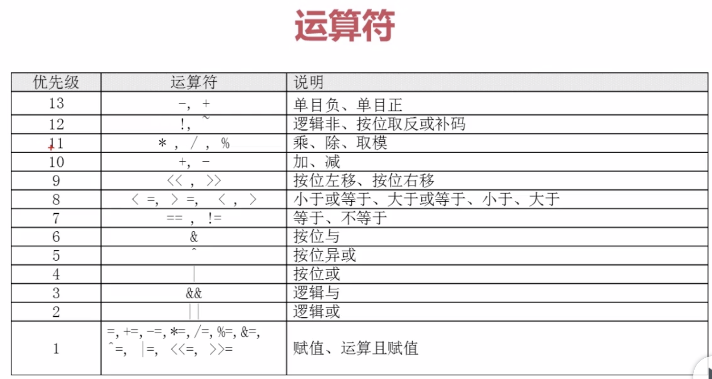

Shell变量的缺点

* 弱类型
* 默认字符串型(不能进行加减乘除运算)

```
# demo
~ a=1
➜  ~ b=2
➜  ~ c=$a+$b
➜  ~ echo $c
1+2
```
```
# 声明变量c的类型为整型，它的值是变量a和变量b的和
➜  ~ declare -i c=$a+$b
➜  ~ echo $c
3
```
```
➜  ~ test[1]=a
➜  ~ test[2]=b
➜  ~ test[3]=c
➜  ~ declare -a test[4]=d
declare: test[4]: inconsistent type for assignment
➜  ~ echo ${test[*]}
a b c
➜  ~ echo ${test[1]}
a
➜  ~ echo ${test}
a b c
```
### 1. declare命令
```
# declare声明变量类型
declare [+/-][选项] 变量名
```
* +：取消变量的类型属性
* -：给变量设定类型属性
* -a：将变量a声明为数组型
* -i：将变量声明为整数型(integer)
* -x：将变量声明为环境变量
* -r：将变量声明为只读变量
* -p：显示指定变量的被声明的类型

#### 声明环境变量
```
# 和expoort作用相似，但其实是declare命令的作用
declare -x test=123
```
```
# 设置test为只读
declare -r test
# 不可以更改值
➜  ~ test=123
zsh: read-only variable: test
# 不可以删除
➜  ~ unset test
zsh: read-only variable: test
```
>特比注意：当给一个变量赋予只读属性时，该变量将不能被修改、删除，甚至不能取消只读属性。

```
# 查询所有变量的属性
declare -p
# 查询指定变量的属性
declare -p 变量名
```
### 2. 数值运算的方法
```
# 方法1
a=1
b=2
declare -i c=$a+$b

# 方法2(expr或let数值运算工具)
a=1
b=2
c=$(expr $a + $b)

# 方法3："$((运算式))"或"$[运算式]"
a=1
b=2
c=$(($a+$b))
d=$[$a+$b]
```
>需要注意："+"左右两侧必须要有空格



>注意：优先级数值越大，该运算符的优先级越高

### 3. 变量测试