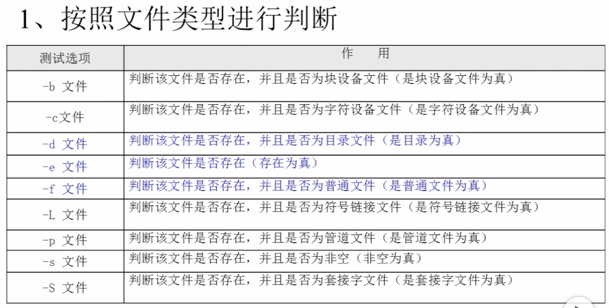
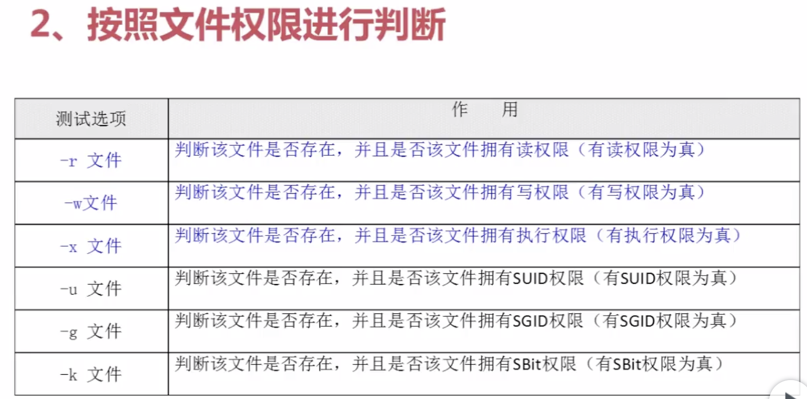
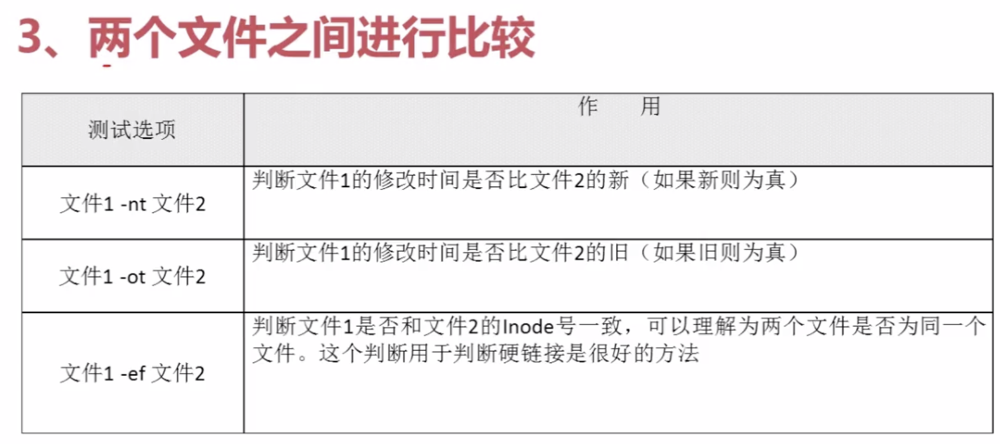
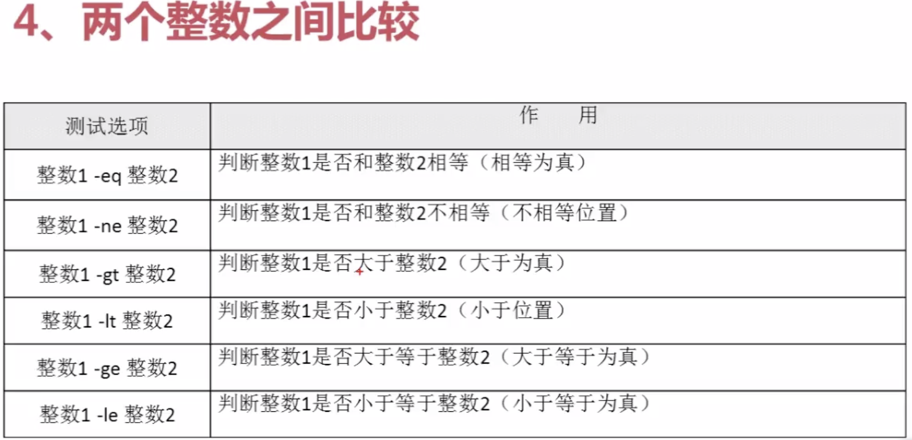
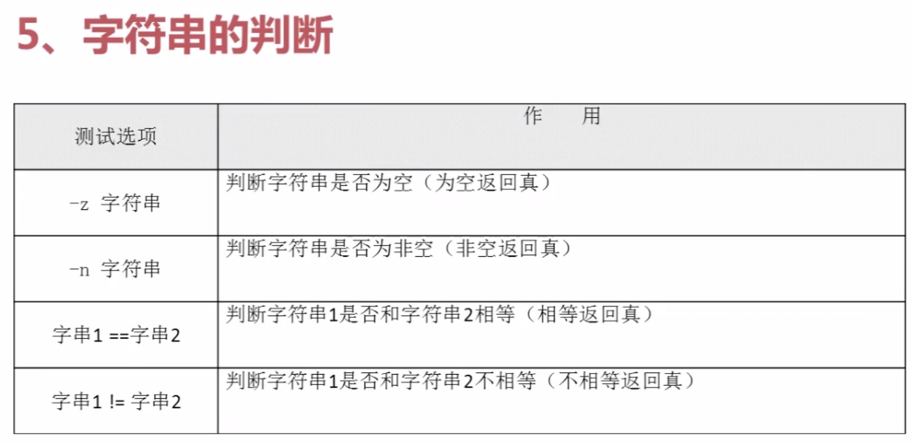

#### 两种判断格式
```
# 格式1
test -e /root/test.sh
# 格式2(推荐使用)
[ -e /root/test.sh ]
```
```
# 判断当前目录是否存在test.py文件，存在输出0，不存在输出1
➜  ~ [ -e ./test.py ] && echo 0 || echo 1
0
➜  ~ [ -e ./twwwest.py ] && echo 0 || echo 1
1
```




```
# 创建一个硬链接
ln /root/test.txt /temp/demo.txt
# 测试是否为同一个文件
[ /root/test.txt -ef /temp/demo.txt ] && echo yes || echo no
```

* -nt: new time
* -ot: old time
* -ef: equal file 是否为相同的源文件

>注意：-ef 应该只是能判断是不是链接，并不能判断软硬



* -eq： equal 等于
* -ne： not equal 不等于
* -gt： greater than 大于
* -lt： less than 小于
* -ge： greater or equal 大于等于
* -le： less or equal 小于等于




* -a: -and
* -o: -or

```
a=11
# 判断变量a是否有值，同时变量a的值是否大于23
[ -n "$a" -a "$a" -gt 23 ] && echo yes || echo no
```
#### 如何'背'程序
* 抄写程序代码并能正确运行
* 为程序补全注释
* 删掉注释，为代码重新添加注释
* 看注释写代码
* 删掉代码和注释，从头开始写

#### 单分支if条件语句
```
if [ 条件判断式 ]; then
	程序
fi
# 或者
if [ 条件判断式 ]
	then
	程序
fi
```
注意以下3点：

* if语句使用fi结尾，和一般语言使用大括号结尾不同
* [ 条件判断式 ]就是使用test命令判断，所以中括号和条件判断式之间必须有空格
* then后面跟符合条件之后执行的程序，可以放在[]之后，用";"分割，也可以换行写入，就不需要";"了

```
# demo1(判断当前登录用户是否为root)
# demo1.sh
#!/bin/bash

# 从环境变量中过滤出包含"USER"字符的行,结果为USER=root; 然后使用字符串截取命令cut,按 分隔符为"=",取第二列数据 的参数取出root值
test=$(env | grep "USER" | cut -d "=" -f 2)

# "=="是字符串判断是否相等命令 ps:[]里的数据，两边需要加空格，否则会报命令错误
if [ "$test" == "root" ]
	then
	echo "Current user is root"
fi
```
```
# demo2(判断分区使用率)
#!/bin/bash
#匹配出包含 sda5的行,取分区使用率这一列(楼主是第五列),用cut 按 "%"分割、取第一列的 参数取出根分区的使用率，赋值给变量test
test=$(df -h | grep "sda5" | awk '{print $5}' | cut -d '%' -f 1)
#如果变量test大于等于10,则输出
if [ "$test" -ge '10' ]
	then
	echo "/ is null"
fi
```
#### 双分支if语句
```
if [条件判断式]
	then
		条件成立时执行的程序
	else
		条件不成立时执行的程序
fi
```
```
#!/bin/bash
#read：接收键盘输入；-t 秒数：read命令会一直等待用户输入，使用此选项可以指定等待时间；-p：提示信息。
read -t 30 -p "please input the dir：" dir

#-d判断是不是一个目录
if [ -d "$dir" ]
	then
		echo "输入的是目录"
	else
		echo "输入的不是目录"
fi
```
```
apache服务：web服务，www服务
ps aux：查看系统中所有正在运行的进程，
apache关键字httpd
# 但是 ps aux | grep httpd 本身也会产生一条包含httpd的进程
# 搜索时去掉带有grep的结果
grep -v grep：取反，不包含grep

```
判断apache服务是否启动：如果`ps aux | grep httpd | grep -v grep`有记录，则说明apache服务启动，否则没有启动。

```
#判断apache服务是否启动
test=$(ps aux | grep httpd | grep -v grep)
#定义变量test，并且查找是否启动apache的结果赋值给test
#ps aux：查看当前所有正在运行的进程
#grep httpd 过滤出apache进程
#grep -v grep 去掉包含grep的进程 -v 取反

if [ -n "$test" ]
#判断test是否为空
	then
#如果不为空则执行这段程序 把结果写入/tmp/autostart-acc.log 中
		echo " $(date) httpd is ok " >> /tmp/autostart-acc.log
	else
#如果为空这执行这段程序
#首先启动httpd服务
	/etc/rc.d/init.d/httpd start &>/dev/null
#然后把事件记录在错误日志中
	echo " $(date) httpd is no \n httpd is autostart now" >> /tmp/autostart-err.log
fi
```
#### 多分支if语句
```
if [ 条件判断式1 ]
	then
		当条件判断式1成立时执行的程序
elif [ 条件判断式2 ]
	then 
		当条件判断式2成立时执行的程序
...省略更多条件
else 
	当所有条件都不成立时执行此程序
fi
```
```
# demo(计算器)
#!/bin/bash
#通过read命令接收要计算的数值，并赋予变量num1和num2
read -t 30 -p "Please input number1: " num1
read -t 30 -p "Please input number2: " num2
#通过read命令接收要计算的符号，并赋予变量ope
read -t 30 -p "Please input an oprator: " ope
#-o表示或的意思即or
if [ "$ope" == '+' -o "$ope" == '-' -o "$ope" == '*' -o "$ope" == '/' ]

then
	result=$(($num1$ope$num2))
	echo $result
else
	echo "Please input a valid oprator."
fi
```
```
#!/bin/bash

read -t 30 -p "Please input num1: " num1
read -t 30 -p "Please input num2: " num2
read -t 30 -p "Please input a operator: " ope
#第一层判断，用来判断num1、num2和ope中都有值
if [ -n "$num1" -a -n "$num2" -a -n "$ope" ]
	then
		#定义变量test1和test2的值为$(命令)的结果
		#后续命令作用是：把变量test1的值替换为空。如果能替换为空，证明num1的值为数字
		#如果不能替换为空，证明num1的值为非数字。使用这种方法判断变量num1的值为数字
		#用同样的方法测试test2变量
		test1=$(echo $num1 | sed 's/[0-9]//g')
		test2=$(echo $num2 | sed 's/[0-9]//g')
		#第二层判断，用来判断num1和num2为数值
		#如果变量test1和test2的值为空，则证明num1和num2是数字
		if [ -z "$test1" -a -z "$test2" ]
			#如果变量test1和test2是数字，则执行以下命令
			then
				第三层判断用来确认运算符
				if [ "$ope" == '+' ]
					then
						res=$(($num1+$num2))
				elif [ "$ope" == '-' ]
					then
						res=$(($num1-$num2))
				elif [ "$ope" == '*' ]
					then
						res=$(($num1*$num2))
				elif [ "$ope" == '/' ]
					then
						res=$(($num1/$num2))
				else
					#如果运算符不匹配，提示输入有效的符号
					echo "Please enter a valid symbol"
					#并退出程序，返回错误代码10
					exit 10
				fi
			else
				#如果test1和test2不是数值
				#则提示输入有效的数值
				echo "Please enter a valid value"
				#并退出程序，返回错误代码11
				exit 11
		fi
	else
		echo "Please enter values"
		exit 12
fi
echo "$num1$ope$num2=$res"
```
```
#demo(判断用户输入的是什么文件)
#!/bin/bash
#接收键盘的输入，并赋予变量filename
read -t 30 -p "please input a filename : " filename
#判断filename变量是否为空
if [ -z "$filename" ]
        then
        	echo "Error，please input a filename"
        	exit 1
#判断filename的值是否存在
elif [ ! -e  "$filename" ]
        then
        	echo "Your input is not a file"
			exit 2
#判断filename的值是否为普通文件
elif [ -f "$filename" ]
        then
        echo "$filename is a regulare file"
#判断filename的值是否为目录文件
elif [ -d "$filename" ]
        then
        echo "$filename is a directory"
else
        echo "$filename is an other file"
fi
```
#### 多分支case语句
case语句和if...elif...else语句一样都是多分支条件语句，不过和if多分支语句不同的是，case语句只能判断一种条件关系，而if语句可以判断多种条件关系。

```
# 多分支语句case格式：
case $变量名 in
  "值1")
       如果变量值等于值1，执行程序1
       ;;
  "值2")
       如果变量值等于值2，执行程序2
       ;;
  ……
  ……
   *）
      如果变量值都不是以上值，则执行此程序
      ;;
esac
```
```
#case实例，选择课程
#!/bin/bash

echo "1 :  yuwen"
echo "2 :  shuxue"
echo "3 :  yingyu"
read -t 30 -p "choose kecheng:" cho

case $cho in
        "1")
                echo "choose yuwen."
                ;;
        "2")
                echo "choose shuxue."
                ;;
        "3")
                echo "choose yingyu"
                ;;
        *)
                echo "choose wrong"
                ;;
esac
```
#### for循环
```
#in后面跟几个值，for循环就执行几次
for 变量 in 值1 值2 值3...
	do
		程序
	done
```
```
#!/bin/bash

for i in 1 2 3 4 5
	do
		echo $i
	done
```
```
#demo(批量解压缩包)
#!/bin/bash

cd /root/test

#覆盖
ls *.tar.gz > ls.log
#添加
ls *.tgz >> ls.log
for i in $(cat ls.log)
	do
		tar -zxvf $i & > /dev/null
	done
rm -rf ls.log
```
```
# 语法二
for((初始值;循环控制条件;变量变化))
	do
		程序
	done
```
```
#!/bin/bash
#从1加到100

sum=0
for((i=1;i<=100;i=i+1))
	do
		sum=$(($sum+$i))
	done
echo "The sum of 1+2+...+100 is : $sum"
```
```
#批量添加指定数量的用户实例
#!/bin/bash
read -t 30 -p "input user name:" name
read -t 30 -p "input password:" pass
read -t 30 -p "input user number:" num
#检查输入内容是否为非空
if [ -n "$name" -a -n "$pass" -a -n "$num" ]
        then
#检查输入的用户数量是否为纯数字 
        chknum=$( echo "$num" | sed 's/[0-9]//g' )
        if [ -z "$chknum" ]
                then
                     for(( i=1;i<="$num";i=i+1 ))
                 		do
								#添加用户
   								/usr/sbin/useradd $name$i
#添加用户密码，passwd 的--stdin参数是非交互输入，直接传入密码，不需要第二次确认
               echo $pass | /usr/bin/passwd --stdin $name$i
               echo "add $i"
               done
        else
                echo "the num must be number"
        fi
else
        echo "must be input name pass num"
fi
```

>赋予脚本执行权限：chmod 755 脚本名称

### while循环和until循环
#### while循环
while循环是不定循环，也称条件循环。只要条件判断式成立，循环就会一直继续，直到条件判断式不成立，循环才会停止。这就和for的固定循环不太一样了。

```
#格式:
while[ 条件判断式]
      do
      	  程序
      done
```
```
#!/bin/bash
#从1加到100
sum=0
i=1
#如果变量i的值小于等于100,则执行循环
while [ $i -le 100 ]
        do
            sum=$(( $sum+$i ))
            i=$(( $i+1 ))
        done
echo "sum is : $sum"
```
#### until循环
until循环和while循环相反，until循环时只要条件判断式不成立则进行循环，并执行循环程序。一旦循环条件成立，则终止循环。

```
格式：
until [ 条件判断式 ]
   do 
       程序
   done
```
```
#until循环实例
#!/bin/bash
#until循环1加到100
sum=0
i=1
#循环直到变量i的值大于100，就停止循环
until [ $i -gt 100 ]
        do
            sum=$(( $sum+$i ))
            i=$(( $i+1 ))
        done
echo "The sum is: $sum"
```