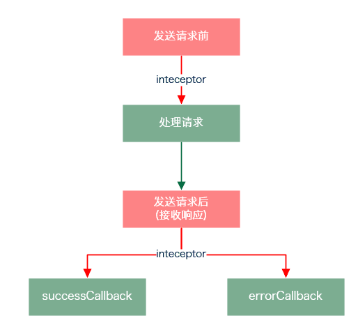

### 1. 简介
Axios 是一个基于 promise 的 HTTP 库，可以用在浏览器和 node.js 中。
#### 1.1 特征
1. 从浏览器中创建 XMLHttpRequests;
2. 从 node.js 创建 http 请求;
3. 支持 Promise API;
4. 拦截请求和响应;
5. 转换请求数据和响应数据;
6. 取消请求;
7. 自动转换 JSON 数据;
8. 客户端支持防御 XSRF。

#### 1.2 安装
采用npm:

```
$ npm install axios --save
```
#### 1.3 相关请求示例

```
# get请求
// 为给定 ID 的 user 创建请求
axios.get('/user?ID=12345')
  .then(function (response) {
    console.log(response);
  })
  .catch(function (error) {
    console.log(error);
  });

// 也可以通过 params 对象传递参数
axios.get('/user', {
    params: {
      ID: 12345
    }
  })
  .then(function (response) {
    console.log(response);
  })
  .catch(function (error) {
    console.log(error);
  });
```
```
# post请求
axios.post('/user', {
    firstName: 'Fred',
    lastName: 'Flintstone'
  })
  .then(function (response) {
    console.log(response);
  })
  .catch(function (error) {
    console.log(error);
  });
```
```
# 执行多个并发请求
function getUserAccount() {
  return axios.get('/user/12345');
}

function getUserPermissions() {
  return axios.get('/user/12345/permissions');
}

axios.all([getUserAccount(), getUserPermissions()])
  .then(axios.spread(function (acct, perms) {
    // 两个请求现在都执行完成
  }));
```
### 2. axios API
可以通过向`axios`传递相关配置来创建请求, 即`axios(config)`。

```
// 发送 POST 请求
axios({
  method: 'post',
  url: '/user/12345',
  data: {
    firstName: 'Fred',
    lastName: 'Flintstone'
  }
});
```
### 3. 拦截器
在请求或响应被 `then` 或 `catch` 处理前拦截它们。

```
//添加请求拦截器
axios.interceptors.request.use(function (config) {
    //在发送请求之前做些什么
    return config;
  }, function (error) {
    //对请求错误做些什么
    return Promise.reject(error);
  });

//添加响应拦截器
axios.interceptors.response.use(function (response) {
    //对响应数据做点什么
    return response;
  }, function (error) {
    //对响应错误做点什么
    return Promise.reject(error);
  });
```
如果你想在稍后移除拦截器，可以这样：

```
var myInterceptor = axios.interceptors.request.use(function () {/*...*/});
axios.interceptors.request.eject(myInterceptor);
```
下图也清晰的展示了拦截器在HTTP请求中的作用。


特别说明: 图片来源于[前端 | 浅谈axios](http://www.jianshu.com/p/065294e2711c)
### 4. 创建实例
可以使用自定义配置新建一个 axios 实例

```
# axios.create([config])
var instance = axios.create({
  baseURL: 'https://some-domain.com/api/',
  timeout: 1000,
  headers: {'X-Custom-Header': 'foobar'}
});
```
实例方法
以下是可用的实例方法。指定的配置将与实例的配置合并

```
axios#request(config)
axios#get(url[, config])
axios#delete(url[, config])
axios#head(url[, config])
axios#post(url[, data[, config]])
axios#put(url[, data[, config]])
axios#patch(url[, data[, config]])
```
### 参考文档
1. [Axios 中文说明](https://www.kancloud.cn/yunye/axios/234845)
2. [Axios-源码分析](http://hejx.space/2017/08/25/Axios-%E6%BA%90%E7%A0%81%E5%88%86%E6%9E%90/)
