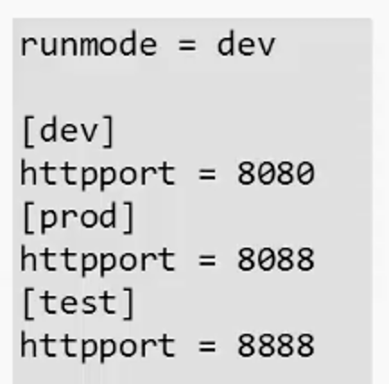

### 1. beego中的配置文件
#### 1.1 配置文件的读取
```
#读取布尔类型的配置项
beego.AppConfig.Bool("key")
#读取字符串类型的配置项
beego.AppConfig.String("key")
#读取整型类型配置项
beego.AppConfig.Int("key")
#读取Int64类型的配置项
beego.AppConfig.Int64("key")
#读取Float类型的配置项
beego.AppConfig.Float("key")
```
##### 1.1.1 section操作


在默认情况下配置文件app.conf中会有配置项runmode,runmode对应的就是配置的section，示例中runmode为dev则读取的httpport为8080。
##### 1.1.2 section::key的读取
通过`String("section::key")`可以读取指定section的key所对应的值，上例中想读取8080，可以这样操作：`String("dev::httpport")`。
##### 1.1.3 其他格式配置文件(json格式)
先导入`github.com/astaxie/beego/config`包。

```
#导入相应的包
import "github.com/astaxie/beego/config"
#NewConfig方法第一个参数表示配置文件类型，第二个参数表示配置文件路径
#初始化配置
conf, err := conf.NewConfig("json", "conf/testini.conf")
#读取配置
val := conf.String("dev::appname")
```
#### 1.2 分组配置的使用
将配置项分布到不同的文件中易于管理。

例如：开发者默认配置项放到一个文件中，用户配置放到另外一个文件中。(特别注意：相同的配置项后面的会覆盖前面的)

可以使用`include`命令引入用户自定义的配置文件。
#### 1.3 config模块详解
##### 1.3.1 config模块的初始化

##### 1.3.2 config模块的API
