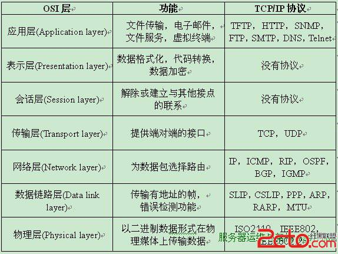
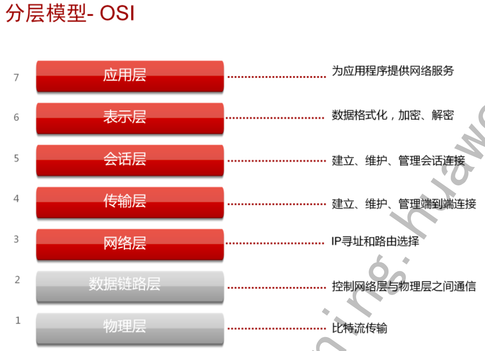
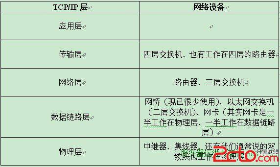

### 名词解释

* OSI：开放系统互连参考模型 (Open System Interconnect 简称OSI）。
* TCP：TCP（Transmission Control Protocol 传输控制协议）是一种面向连接的、可靠的、基于字节流的传输层通信协议。
* IP：网络之间互连的协议（IP）是Internet Protocol的外语缩写，中文缩写为“网协”。
HTTP：超文本传输协议（HTTP，HyperText Transfer Protocol)是互联网上应用最为广泛的一种网络协议。
* HTTPS：HTTPS（全称：Hyper Text Transfer Protocol over Secure Socket Layer），是以安全为目标的HTTP通道，简单讲是HTTP的安全版。

### OSI七层模型(每层解释)

### OSI七层结构–每层结构的功能

### TCP/IP五层模型
OSI七层模型与TCP/IP五层模型的关系

### OSI七层模型-每层的设备

### 对各层的详细说明
#### 第一层是物理层（PhysicalLayer)，
规定通信设备的机械的、电气的、功能的和过程的特性，用以建立、维护和拆除物理链路连接。
具体地讲，机械 特性规定了网络连接时所需接插件的规格尺寸、引脚数量和排列情况等；
电气特性规定了在物理连接上传输bit流时线路上信号电平的大小、阻抗匹配、传输速率 距离限制等；
功能特性是指对各个信号先分配确切的信号含义，即定义了DTE和DCE之间各个线路的功能；
规程特性定义了利用信号线进行bit流传输的一组 操作规程，是指在物理连接的建立、维护、交换信息是，DTE和DCE双放在各电路上的动作系列。
在这一层，数据的单位称为比特（bit）。属于物理层定义的典型规范代表包括：EIA/TIA RS-232、EIA/TIA RS-449、V.35、RJ-45等。
#### 第二层是数据链路层
在物理层提供比特流服务的基础上，建立相邻结点之间的数据链路，通过差错控制提供数据帧（Frame）在信道上无差错的传输，
并进行各电路上的动作系列。数据链路层在不可靠的物理介质上提供可靠的传输。
该层的作用包括：物理地址寻址、数据的成帧、流量控制、数据的检错、重发等。
在这一层，数据的单位称为帧（frame）。数据链路层协议的代表包括：SDLC、HDLC、PPP、STP、帧中继等。
#### 第三层是网络层
在计算机网络中进行通信的两个计算机之间可能会经过很多个数据链路，也可能还要经过很多通信子网。
网络层的任务就是选择合适的网间路由和交换结点， 确保数据及时传送。
网络层将数据链路层提供的帧组成数据包，包中封装有网络层包头，其中含有逻辑地址信息- -源站点和目的站点地址的网络地址。
如果你在谈论一个IP地址，那么你是在处理第3层的问题，这是“数据包”问题，而不是第2层的“帧”。
IP是第3层问题的一部分，此外还有一些路由协议和地 址解析协议（ARP）。有关路由的一切事情都在这第3层处理。
地址解析和路由是3层的重要目的。网络层还可以实现拥塞控制、网际互连等功能。在这一层，数据的单位称为数据包（packet）。
网络层协议的代表包括：IP、IPX、RIP、OSPF等。
#### 第四层是处理信息的传输层
第4层的数据单元也称作数据包（packets）。但是，当你谈论TCP等具体的协议时又有特殊的叫法，
TCP的数据单元称为段 （segments）而UDP协议的数据单元称为“数据报（datagrams）”。
这个层负责获取全部信息，因此，它必须跟踪数据单元碎片、乱序到达的 数据包和其它在传输过程中可能发生的危险。
第4层为上层提供端到端（最终用户到最终用户）的透明的、可靠的数据传输服务。
所为透明的传输是指在通信过程中 传输层对上层屏蔽了通信传输系统的具体细节。
传输层协议的代表包括：TCP、UDP、SPX等。
#### 第五层是会话层
这一层也可以称为会晤层或对话层，在会话层及以上的高层次中，数据传送的单位不再另外命名，
而是统称为报文。会话层不参与具体的传输，它提供包括访问验证和会话管理在内的建立和维护应用之间通信的机制。
如服务器验证用户登录便是由会话层完成的。
#### 第六层是表示层
这一层主要解决拥护信息的语法表示问题。它将欲交换的数据从适合于某一用户的抽象语法，
转换为适合于OSI系统内部使用的传送语法。即提供格式化的表示和转换数据服务。
数据的压缩和解压缩， 加密和解密等工作都由表示层负责。
#### 第七层应用层
应用层为操作系统或网络应用程序提供访问网络服务的接口。
应用层协议的代表包括：Telnet、FTP、HTTP、SNMP等。

### 参考文档
1. [OSI七层与TCP/IP五层网络架构](https://fanerge.github.io/2017/10/14/OSI%E4%B8%83%E5%B1%82%E4%B8%8ETCP-IP%E4%BA%94%E5%B1%82%E7%BD%91%E7%BB%9C%E6%9E%B6%E6%9E%84/)
2. [OSI七层与TCP/IP五层网络架构详解](https://www.2cto.com/net/201310/252965.html)
3. [OSI七层模型与TCP/IP五层模型](http://www.cnblogs.com/qishui/p/5428938.html)