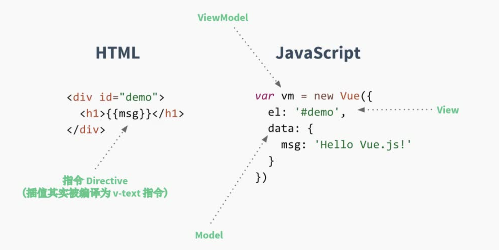
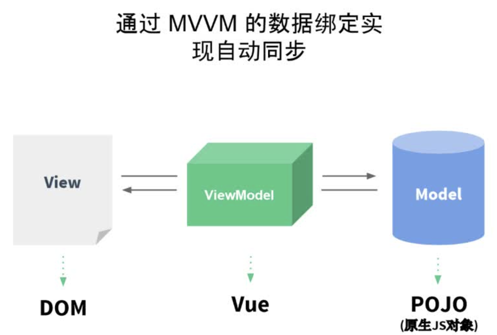
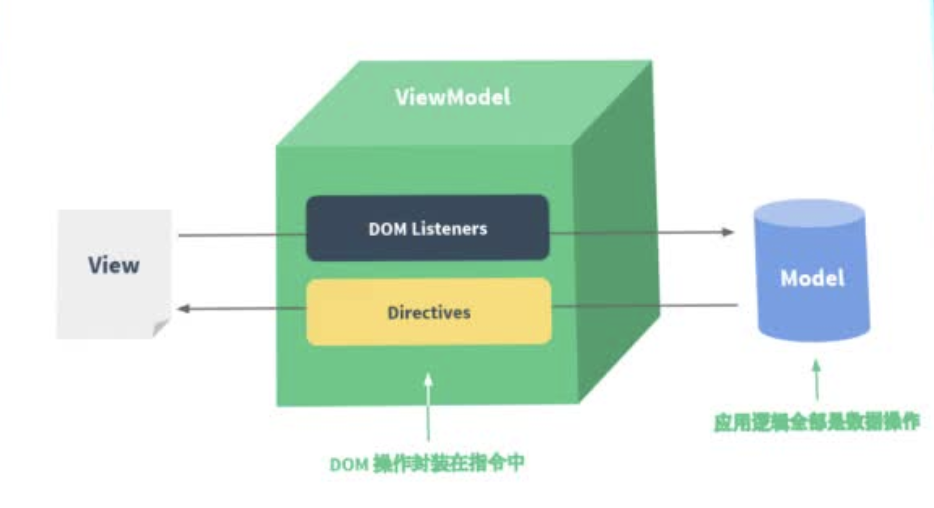

目前一些主流的前端框架实现数据绑定的方式：

* 数据劫持 (Vue)
* 脏值检查 (Angular，React)

### 1. 前端工程
#### 配置开发时前端工程
#### 实现一个简单的TODO应用
#### 优化配置达到上线标准
#### 前端的价值
##### 搭建前端工程
前端工程化的价值：数据缓存。现在的前端开发并不像之前的所见即所得了，我们使用了ES6、Less/Sass等这些浏览器不能直接识别，但是这些又能加快我们的开发效率，我们不得不去使用。
##### 网络优化
如何加快http请求速度？
如何缓存Http请求数据？
##### API定制
前后端分离(json数据)。
##### nodejs层
webpack等都是基于node环境。
### 2. webpack
### 3. vue2介绍
MVVM 是 `Model-View-ViewModel` 的缩写，它是一种基于前端开发的架构模式，其核心是提供对View 和 ViewModel 的双向数据绑定，这使得ViewModel 的状态改变可以自动传递给 View，即所谓的数据双向绑定。

Vue.js 是一个提供了 MVVM 风格的双向数据绑定的 Javascript 库，专注于View 层。它的核心是 MVVM 中的 VM，也就是 ViewModel。 ViewModel负责连接 View 和 Model，保证视图和数据的一致性，这种轻量级的架构让前端开发更加高效、便捷。

MVVM 由 Model，View，ViewModel 三部分构成，Model 层代表数据模型，也可以在Model中定义数据修改和操作的业务逻辑；View 代表UI 组件，它负责将数据模型转化成UI 展现出来，ViewModel 是一个同步View 和 Model的对象。

在MVVM架构下，View 和 Model 之间并没有直接的联系，而是通过ViewModel进行交互，Model 和 ViewModel 之间的交互是双向的， 因此View 数据的变化会同步到Model中，而Model 数据的变化也会立即反应到View 上。

ViewModel 通过双向数据绑定把 View 层和 Model 层连接了起来，而View 和 Model 之间的同步工作完全是自动的，无需人为干涉，因此开发者只需关注业务逻辑，不需要手动操作DOM, 不需要关注数据状态的同步问题，复杂的数据状态维护完全由 MVVM 来统一管理。

>特别说明：MVVM 的核心是 ViewModel 层，它就像是一个中转站（value converter），负责转换 Model 中的数据对象来让数据变得更容易管理和使用，该层向上与视图层进行双向数据绑定，向下与 Model 层通过接口请求进行数据交互，起呈上启下作用。





#### 3.1 数据绑定
#### 3.2 生命周期方法
#### 3.3 computed

#### chunkhash与hash的区别
### 挂载点，模板与实例
```
<!DOCTYPE html>
<html lang="en">
<head>
    <meta charset="UTF-8">
    <meta name="viewport" content="width=device-width, initial-scale=1.0">
    <meta http-equiv="X-UA-Compatible" content="ie=edge">
    <title>Vue入门</title>
    <script src="./vue.js"></script>
</head>
<body>
    <!-- 挂载点，模板，实例之间的关系 -->
    <div id="root"></div>
    <script>
        new Vue({
            el: "#root",
            template: '<h1>hello {{msg}}</h1>',
            data: {
                msg: 'world'
            }
        })
    </script>
</body>
</html>
```
```
# 该div就是挂载点
<div id="root"></div>
```
```
# 这是实例
new Vue({
        el: "#root",
        template: '<h1>hello {{msg}}</h1>', //模板
        data: {
            msg: 'world'
        }
    })
```
#### 组件与实例的关系
每个组件都是一个小的vue实例，在组件中也可以绑定事件。
### 单向数据绑定和双向数据绑定
单向数据绑定：数据决定页面显示内容，但是页面显示内容无法改变数据。

双向数据绑定(v-model指令)：
#### v-if和v-show指令区别
* v-if：将dom元素从dom树中移除
* v-show：给dom元素设置display:none

### 核心思想
#### 数据驱动
#### 组件化
#### 异步批量更新
```
vm.msg = 'one';
vm.msg = 'two';
vm.msg = 'three';
// 更改同一个属性多次，只会触发一次dom更新
```
### Vue-cli的简介与使用
### 文件说明
* compile.js：模板编译
* observer.js：数据劫持
* MVVM.js：整合数据


### 参考文档
1. [Vue2原理浅谈](http://imhjm.com/article/59b902107dd03248a2e8d584)
2. [Vue 2.0的学习笔记： Vue实例和生命周期](https://www.w3cplus.com/vue/vue-instances-and-life-cycles.html)
3. [vue常见面试题](https://juejin.im/post/5aa00229f265da239b40fc02)
4. [Vue Loader](https://vue-loader.vuejs.org/zh/guide/pre-processors.html#less)
5. [webpack学习中遇到的坑](https://segmentfault.com/a/1190000013998339?utm_source=tag-newest/*&^%$)
6. [vue-cli中的webpack配置](https://www.cnblogs.com/libin-1/p/6596810.html)
7. [Vue.js 和 MVVM 的小细节](https://zhuanlan.zhihu.com/p/23938306)
8. [简单理解MVVM--实现Vue的MVVM模式](https://zhuanlan.zhihu.com/p/38296857)
9. [250行实现一个简单的MVVM](https://zhuanlan.zhihu.com/p/24475845?refer=mirone)
10. [实现一个属于我们自己的简易MVVM库](https://zhuanlan.zhihu.com/p/27028242)
11. [MVVM与redux的概念类比](https://zhuanlan.zhihu.com/p/38025611)
12. [MVVM最佳解读和实践](https://zhuanlan.zhihu.com/p/38270598)