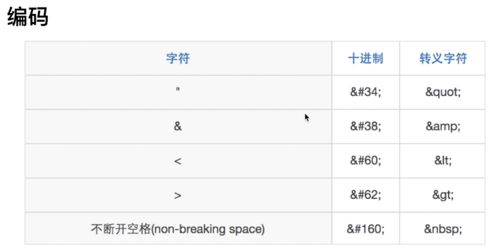

### 1. XSS的攻击原理和手段
#### 1.1 理解XSS的攻击方式

* 反射型：发出请求时，XSS代码出现在URL中，作为输入提交到服务器端，服务器端解析后响应，XSS	代码随响应内容一起传回给浏览器，最后浏览器解析执行XSS代码。这个过程像一次反射，故叫反射性XSS。
* 存储型: 存储型XSS和反射型XSS的差别仅在于：提交的代码会存储在服务端(数据库，内存，文件系统等)，下次请求目标页面时不用再提交XSS代码。

### 2. XSS攻击的防范措施
#### 2.1 编码
对用户输入的数据进行`HTML Entity`编码。

#### 2.2 过滤
* 移除用户上传的DOM属性，如`onerror和onclick`等与事件相关的属性
* 移除用户上传的`Style`节点、`Script`节点、`Iframe`节点等
#### 2.3 校正
* 避免直接对`HTML Entity`解码
* 使用`DOM Parse`转换，校正不配对的DOM标签
### 参考文档
1. [XSS的原理分析与解剖](http://www.freebuf.com/articles/web/40520.html)